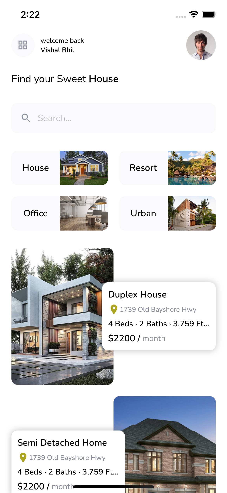

# React Native House Finder UI Template

[](http://makeapullrequest.com)

> A React Native UI template with CLI, React Navigation, and some 💕 included.



## Technologies
- [React Native](https://reactnative.dev/)
- [React Navigation](https://reactnavigation.org/)
- [Vector Icons](https://www.npmjs.com/package/react-native-vector-icons)

## Getting Started
Clone this repository
```
$ git clone https://github.com/vishal-bhil/react-native-house-finder-template.git
```
Install node modules, [Yarn](https://yarnpkg.com/en/) is highly recommended.
```
$ yarn
```
Run on Android/iOS device or simulator
```
$ npx react-native run-ios
$ npx react-native run-android
```
Open project in any [code](https://code.visualstudio.com/) editors and have fun 🍻

## Contribution
All PRs are welcome 💕

## Coming Soon
-Detail Screen<br />
-Search Screen

## Contact

- [Linkedin](https://www.linkedin.com/in/vishal-bhil/)
- [Instagram](https://www.instagram.com/vishal__bhil/)
